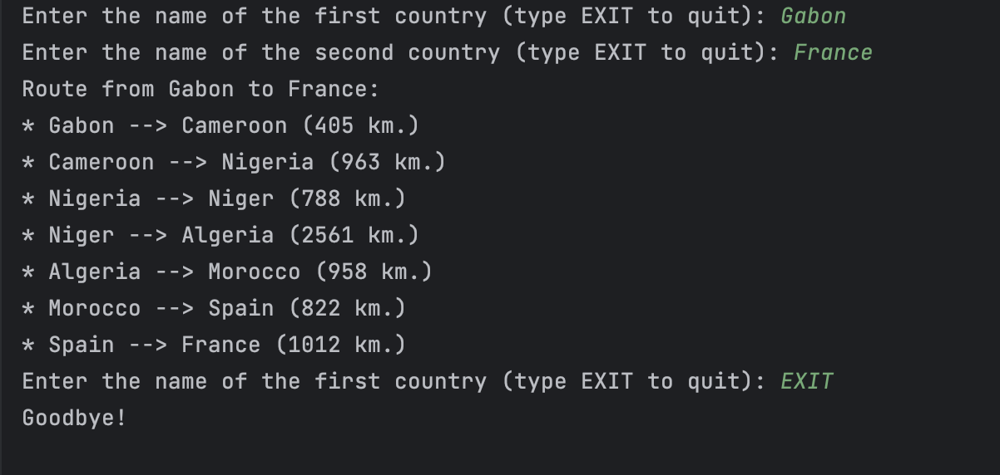
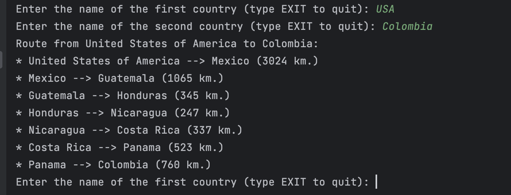
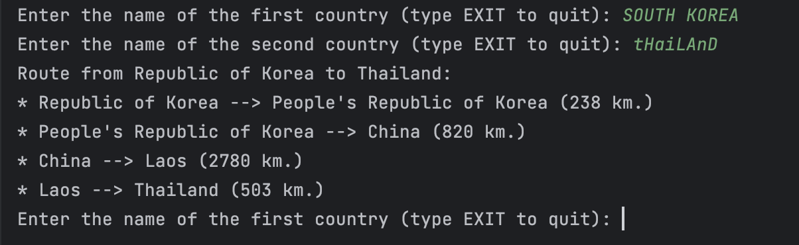
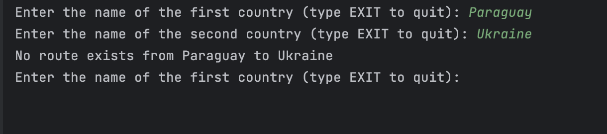

# International Road Trip Planner

## Introduction
The International Road Trip Planner is a Java-based application utilizing
an object-oriented approach to calculate the shortest distance for traveling
between two countries, specifically from capital city to capital city. This
project leverages real-world data from [CIA World Factbook](https://www.cia.gov/the-world-factbook/field/land-boundaries/)
to gather information on borders, distances between capitals, state names/aliases,
and uses this information to create an undirected graph. The application implements
Dijkstra's algorithm to find the most efficient travel path.

## Getting Started

### Prerequisites
- Java Development Kit (JDK)
- An Integrated Development Environment (IDE) or a command line tool

### Installation and Running the Program
1. Clone the repository to your local machine.
```bash
git clone https://github.com/ccrawford4/International-Road-Trip-Planner.git
```
2. Open the project in your IDE or navigate to the project directory in your command line tool.
3. To compile the program, run:
```bash
$ javac Source/Classes/IRoadTrip
```
4. To run the program use:
```bash
$ java Source/Classes/IRoadTrip
```

## Usage
The application can be used to plan road trips between countries by calculating the shortest path from one capital city to another.

### Example Use

#### Cross-continental route calculation



#### (Most) Country Aliases Are Considered


#### Case-Insensitive Searching


#### Error Handling


## Data Structures and Algorithms

### Data Structures
The International Road Trip Planner utilizes a variety of data structures to efficiently handle
and process the geographical and political data of various countries.

- **Undirected Weighted Graph with an Adjacency List**: The core structure of the project. It represents the network of countries and their capital cities, with edges weighted by the distance between them.
- **HashMaps**: Used for storing and quickly accessing the relationship between countries and their corresponding graph nodes.
- **PriorityQueues**: Integral in implementing Dijkstra's algorithm efficiently, used for selecting the next closest node to visit.
- **ArrayLists**: Utilized for dynamically storing lists of connected nodes in the graph structure.
- **LinkedLists**: Employed in various parts of the application for efficient insertion and deletion operations, which are essential in graph traversal and pathfinding.

### Algorithms
The primary algorithm driving the application is Dijkstra's algorithm, renowned for its efficiency in finding the shortest path in a graph.

- **Dijkstra's Algorithm**: Implemented to calculate the shortest distance between two countries, taking into account the undirected and weighted nature of the graph. The algorithm uses a combination of the data structures mentioned above, particularly HashMaps and PriorityQueues, to efficiently determine the shortest path from the start country to any other country. The result is a HashMap where nodes represent the countries, and the values are the shortest distances from the starting country to each respective country.

This blend of data structures and algorithms ensures that the International Road Trip Planner not only provides accurate results but also does so with optimal efficiency and speed.


## Functions
1. **Function One**:
2. **Function Two**:

## Testing
The project employs JUnit for testing. Here's an overview of how the testing works and instructions on
how to run and modify the tests.

### Running Tests
- Instructions on how to execute the tests.

## Limitations
- The application has certain limitations in handling edge cases for specific country aliases and relationships.

## Contact
For any queries or further information, feel free to [contact me via email](mailto:ccrawford6@dons.usfca.edu).